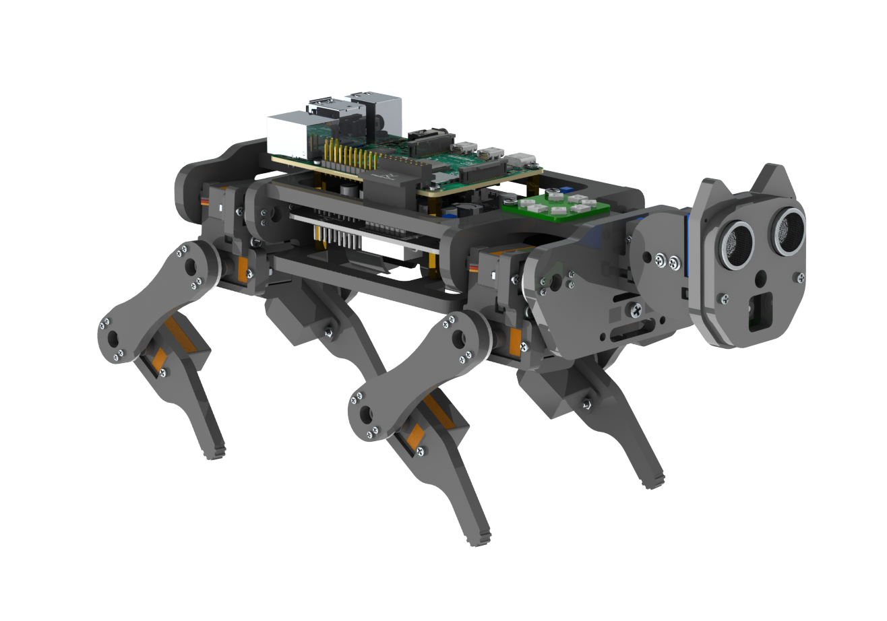

#  FNK0050

This repository was created to “play” with the possibilities offered by the Freenove Robot Dog Kit for Raspberry Pi.
Part of the code comes from the [official Freenove repository] (https://github.com/Freenove/Freenove_Robot_Dog_Kit_for_Raspberry_Pi), whose work is acknowledged and appreciated.

## Objectives
 
 - Learn about computer vision.

 - Experiment with machine learning.

 - Deepen knowledge of robotics.

## Project status
This project is in its early stages; documentation and code will grow as learning progresses.

## Configuración

La aplicación del servidor lee sus parámetros desde `Server/app/config.py`.  Allí se
definen rutas de modelos, umbrales y claves que pueden modificarse directamente o
mediante variables de entorno.  Ejemplos:

- `VISION_ENABLE=0` desactiva el módulo de visión.
- `MOVEMENT_ENABLE=0` desactiva el control de movimiento.
- `VISION_PROFILE=face` cambia el perfil de detección utilizado por la cámara.

También pueden ajustarse otros parámetros como `VISION_THRESHOLD` o
`VISION_MODEL_PATH`, así como la clave `API_KEY` para servicios externos.